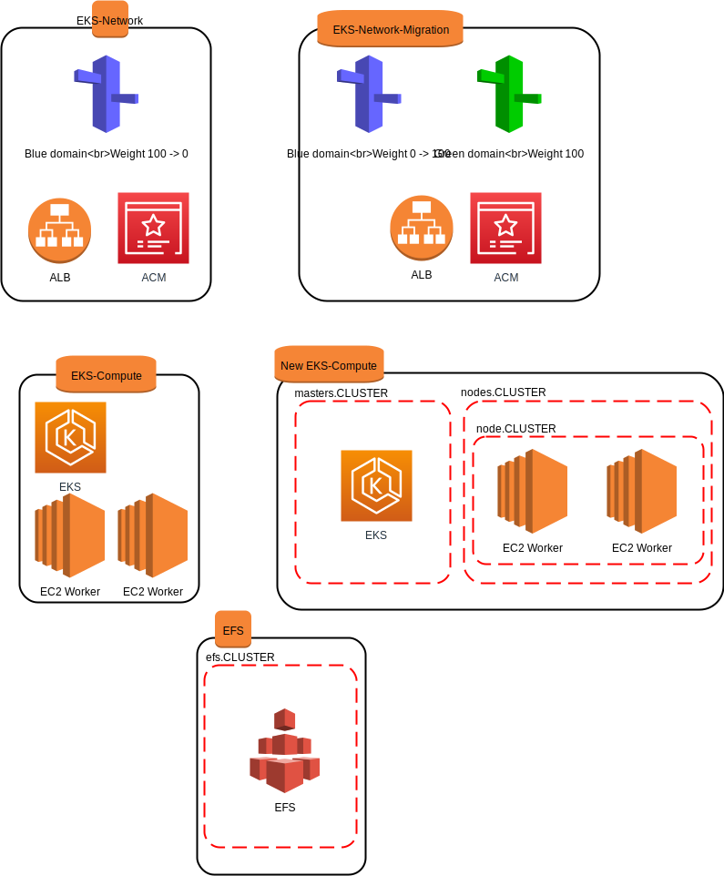

# EKS network module

* EKS Blue -> Green 으로 이관할때 새로운 클러스터(Green set)의 network 자원들을 생성합니다.

* 현재는 ALB, ACM, Route53 을 정의하고 있으며, 추후 NLB 추가를 고려하고 있습니다.

* 아래 그림에서 EKS-Network-Migration 부분을 담당합니다.

* 생성후 Blue set 의 Weight 를 0 으로 변경하고 Green set 의 Blue domain weight 를 100으로 변경하는 terraform apply 가 필요합니다.

* Terraform apply 순서
  1. EKS-Network-Migration apply
      * Blue set Blue.domain 100
      * Green set Blue.domain 0
      * Green.domain 100
  1. Green set 에 어플리케이션 이관 (Green.domain 으로 테스트)
  1. EKS-Network-Migration update -> apply
      * Blue set Blue.domain 100
      * Green set Blue.domain 100
      * Green.domain 100
  1. EKS-Network update -> apply
      * Blue set Blue.domain 0
      * Green set Blue.domain 100
      * Green.domain 100
  1. Green set 에 어플리케이션 테스트 (Blue.domain 으로 테스트)
  1. EKS-Network destroy
      * Blue set Blue.domain 사라짐
      * Green set Blue.domain 100
      * Green.domain 100

## Draw

valve eks 이관

## Graph

> CMD : terraform graph | dot -Tsvg > graph.svg

## Resource

* resource "aws_acm_certificate" "default"

* resource "aws_route53_record" "validation"

* resource "aws_acm_certificate_validation" "default"

* resource "aws_lb" "main"

* resource "aws_security_group" "alb" 

* resource "aws_lb_target_group" "tg_http"

* resource "aws_lb_listener" "frontend_http"

* resource "aws_lb_listener" "frontend_https"

* resource "aws_lb_listener_certificate" "https_listener_no_logs" 

* resource "aws_route53_record" "address"

## Data

* data "aws_route53_zone" "selected" {
  
* data "aws_security_group" "worker_sg_id" {